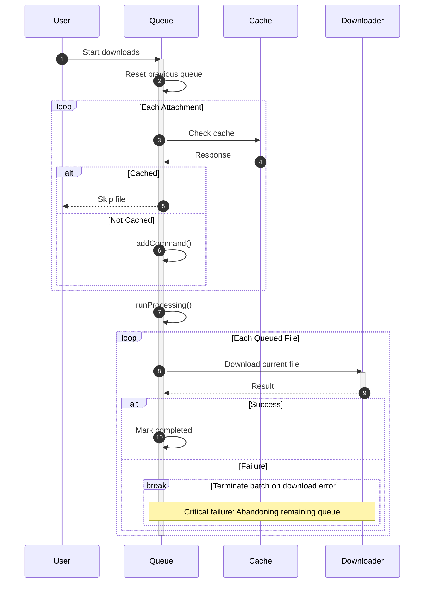

# Scenario 1: Basic Queue File Loading

## Overview
This scenario describes the basic file loading process where files are downloaded sequentially through a managed queue system without any external interruptions or user interactions.

## Technical Implementation
- **Queue Store (Valtio)**: `stores/downloadQueue/valtioState.ts`
- **Progress Tracking**: `stores/downloadProgress/downloadProgressStore.ts`
- **File Management**: `lib/files.ts` using Expo File System v17+ and `react-native-blob-util`
- **Download Context**: `contexts/downloadMessageAttachments.tsx`
- **Download Hook**: `hooks/useDownloadMessageAttachments.tsx`

## User Flow

### Step 1: Queue Initialization
1. User triggers file download action (e.g., downloads message attachments)
2. System checks for existing cached files using `fileExistsInCache(filename)`
3. Queue is reset for a clean batch, then non-cached files are added via `downloadQueueActions.addCommand()`

### Step 2: Sequential Processing
1. After all files are queued, processing begins in a single batch
2. Current queue state is displayed: "Downloading X of Y files"
3. Each file shows individual progress percentage based on bytes received/total
4. Files are downloaded to cache directory using authenticated API calls

### Step 3: Progress Monitoring
1. Real-time progress updates for each file:
   - Bytes received vs total bytes
   - Percentage completion (0-100%)
   - Current filename being processed
2. Queue-level progress tracking:
   - Current file number in sequence
   - Total files in queue
   - Overall completion status

### Step 4: Completion
1. Each completed file is marked as processed in the queue
2. Files are stored in the cache directory for future access
3. Queue progress updates to reflect completion
4. Final status: "All files downloaded successfully"

## Technical Flow

```
User Action → Queue Check → Cache Verification → Download Start
     ↓              ↓              ↓              ↓
Add to Queue → Process Next → Check Network → Download File
     ↓              ↓              ↓              ↓
Update UI → Show Progress → Update Progress → Mark Complete
     ↓              ↓              ↓              ↓
Continue → Process Next → Repeat Process → Queue Empty
```



## Key Features

### Deduplication
- Files are deduplicated by filename before queueing
- Existing cached files are skipped automatically

### Sequential Processing
- Downloads occur one file at a time to prevent overwhelming the device
- Queue maintains order and processes files in FIFO manner

### Persistence
- Queue state (commands + completed IDs) persists via MMKV using Valtio `subscribe()`
- Partial download progress is not persisted; files restart if reprocessed

### Error Handling
- Network errors stop the current file and end processing until re-triggered
- Authentication errors halt processing until resolved
- A failed file stops the processing loop for that batch

## Expected Behavior

### Normal Completion
- Queue processes all files sequentially
- Each file reaches 100% completion
- All files become available in cache
- Queue becomes empty upon completion

### Cache Hit Behavior
- Previously downloaded files are skipped immediately
- Queue only contains new/missing files
- Progress reflects only actual downloads needed

### Network Conditions
- Downloads pause or stop when network is unavailable
- Queue resumes when conditions are restored and processing is re-triggered
- Progress for an interrupted file restarts from the beginning

## UI States

### Loading State
- Progress bar showing current file progress (0-100%)
- Text: "Downloading [filename] ([X] of [Y])"

### Completion State
- Success message: "All files downloaded"
- Download time summary
- Option to view downloaded files

### Error State
- Error message with retry option
- Failed file name and reason
- Queue pause with manual resume capability

## Performance Characteristics

### Memory Usage
- Single file download at a time minimizes memory footprint
- Progress tracking uses minimal state storage
- Cache management prevents duplicate storage

### Network Efficiency
- Authenticated downloads with token injection
- Progress callbacks for real-time feedback
- Connection handling through `react-native-blob-util`

### Storage Management
- Files stored in app cache directory
- Automatic directory creation and management
- Consistent file naming and organization