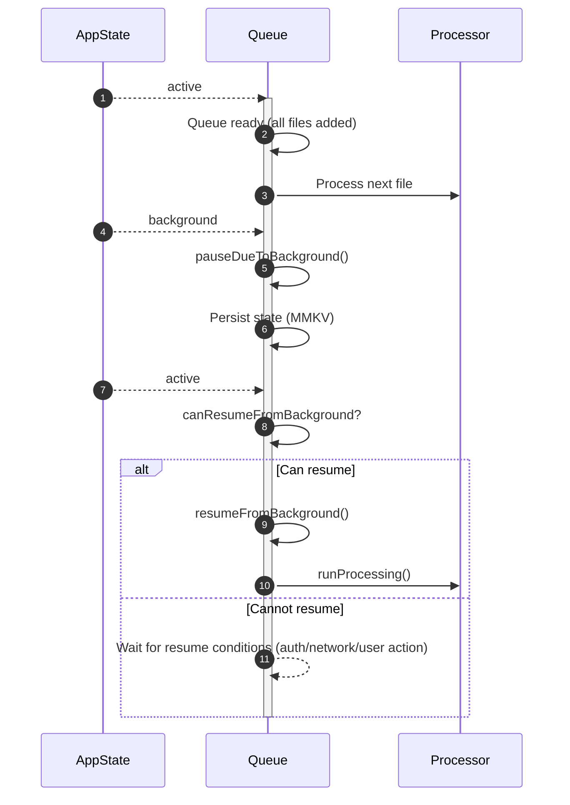

# Scenario 2: Background/Foreground File Loading

## Overview
This scenario describes file loading behavior when the app transitions between background and foreground states during the download process. The system intelligently pauses and resumes downloads based on app state.

## Technical Implementation
- **App State Monitoring**: `hooks/useAppState.tsx`
- **Queue State + Pause Flags**: `stores/downloadQueue/valtioState.ts`
- **Processing Loop + Downloads**: `contexts/downloadMessageAttachments.tsx`
- **Resume Trigger**: `hooks/useDownloadMessageAttachments.tsx`
- **State Detection**: React Native's `AppState` API

## User Flow

### Step 1: Initial Download Start
1. User initiates file download queue
2. Download process begins normally with progress display
3. Files start downloading sequentially as per basic queue scenario

### Step 2: App Goes to Background
1. User switches to another app or locks device
2. App state changes to 'background' or 'inactive'
3. System detects state change via `useAppState()` hook
4. Queue is paused via `pauseDueToBackground()`
5. Current download is not resumed; new files are not started

### Step 3: Background State Handling
1. Downloads remain paused while app is in background
2. Queue state is preserved in persistent storage (MMKV)
3. Partial download progress is maintained
4. No background processing occurs (iOS/Android limitations)

### Step 4: Return to Foreground
1. User returns to the app
2. App state changes to 'active'
3. `useDownloadMessageAttachments` checks `canResumeFromBackground`
4. `resumeFromBackground()` clears the background pause flag
5. Queue processing restarts via `runProcessing()` if items remain

### Step 5: Progress Restoration
1. Queue state is restored from MMKV (Valtio `subscribe()` persistence)
2. Completed files remain marked as finished
3. If a file was mid-download, it restarts from the beginning
4. Progress tracking resumes with updated UI

## Technical Flow

```
Normal Download → Background Detected → Pause Downloads → Preserve State
       ↓                    ↓                  ↓              ↓
App Active → AppState.inactive → Stop Processing → Save to MMKV
       ↓                    ↓                  ↓              ↓
Continue → Background Mode → Network Idle → Queue Preserved
       ↓                    ↓                  ↓              ↓
User Returns → AppState.active → Resume Processing → Restore State
       ↓                    ↓                  ↓              ↓
App Active → Detect Change → Start Downloads → Update UI
```


```

## Key Features

### Automatic State Detection
- Real-time monitoring of app state changes
- Immediate response to background/foreground transitions
- No user intervention required

### Queue Preservation
- Queue state persists via Valtio + MMKV
- Pause reason is tracked in `pausedDueToBackground`
- Queue order and priorities preserved

### Seamless Resumption
- Downloads resume when app is active and processing is re-triggered
- Resume happens via `resumeFromBackground()` + `runProcessing()`
- No manual restart required

### Resource Management
- Downloads pause to conserve battery and data
- Network connections closed properly during background
- Memory usage optimized during inactive state

## Expected Behavior

### Background Transition
1. Active download stops immediately
2. Progress UI shows "Paused" state
3. Network activity ceases
4. Queue maintains current position

### Foreground Restoration
1. Download queue resumes processing
2. Progress UI updates to show current status
3. Network activity restarts
4. Downloads continue from paused state

### State Persistence
- Queue survives app backgrounding
- Completed downloads remain completed
- Failed downloads maintain error state
- Progress indicators restore accurately

## UI States

### Background Transition
- Progress bar shows paused state
- Text: "Downloads paused - app in background"
- Visual indicator of inactive state

### Foreground Resumption
- Progress bar resumes animation
- Text: "Resuming downloads..."
- Normal progress indicators restore

### State Indicators
- Clear visual feedback for pause/resume
- App state awareness in UI
- Proper loading state management

## Performance Characteristics

### Battery Efficiency
- Downloads pause automatically to save battery
- Network connections properly closed
- Background processing minimized

### Data Conservation
- No background data usage
- Downloads resume only when app is active
- Efficient connection management

### Memory Management
- Queue state stored efficiently in MMKV
- Progress tracking uses minimal memory
- Proper cleanup during state transitions

## Edge Cases

### Rapid State Changes
- Multiple quick background/foreground transitions are handled sequentially
- No explicit debouncing is implemented
- Queue stability maintained during state transitions

### Long Background Periods
- Queue state preserved for extended periods
- No data loss during extended background time
- Proper restoration regardless of background duration

### Network Changes During Background
- Network state is re-checked when the app becomes active
- Connection restoration is required before processing restarts
- Errors stop the current file and require a re-trigger

## Implementation Details

### App State Detection
```typescript
const { isAppActive } = useAppState();

// Download processing check
if (!isAppActive) {
  console.log('App is not active, downloads paused');
  return;
}
```

### Queue State Persistence
- Valtio store with MMKV persistence via `subscribe()`
- Automatic state saving during background transitions
- State restoration on foreground return

### Error Recovery
- Network errors handled gracefully during state changes
- Authentication state maintained across transitions
- Proper cleanup and restoration procedures