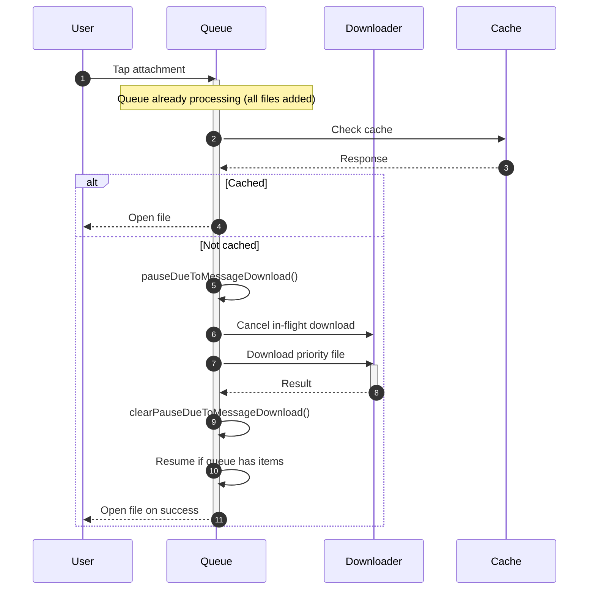

# Scenario 3: Accelerated Loading via Message Attachments

## Overview
This scenario describes the priority download mechanism that occurs when a user clicks on a file attachment within a message during an active download queue. The system temporarily pauses the queue to provide immediate file access.

## Technical Implementation
- **Priority Download**: `contexts/downloadMessageAttachments.tsx`
- **Queue State + Pause Flags**: `stores/downloadQueue/valtioState.ts`
- **Cache Check**: `lib/files.ts`
- **Message UI**: Message attachment click handlers

## User Flow

### Step 1: Queue in Progress
1. Download queue is actively processing files
2. Multiple files are being downloaded sequentially
3. Progress indicators show current download status
4. User navigates to a message with attachments

### Step 2: Attachment Click
1. User clicks on a file attachment in a message
2. System immediately checks cache for the file
3. If file exists in cache, opens immediately
4. If not cached, triggers priority download process

### Step 3: Priority Download Activation
1. Queue processing is paused via `pauseDueToMessageDownload()`
2. Current in-flight download is cancelled (RNFetchBlob cancel)
3. Priority download begins for the clicked file
4. Queue status reflects the paused state

### Step 4: Accelerated Processing
1. Clicked file downloads with full network priority
2. Progress shown specifically for this file
3. Other queued files remain paused
4. Download bypasses normal queue order

### Step 5: Completion and Queue Resumption
1. Priority file download completes
2. File opens automatically (e.g., PDF viewer)
3. File is removed from regular queue if it was queued
4. Message-download pause flag is cleared
5. Queue resumes only if authenticated and not paused for background/auth

## Technical Flow

```
Queue Active → User Clicks → Cache Check → Priority Download
      ↓             ↓            ↓              ↓
Processing → Attachment → File Missing → Pause Queue
      ↓             ↓            ↓              ↓
Sequential → Click Event → Not Cached → Start Priority
      ↓             ↓            ↓              ↓
Continue → Handle Click → Begin Download → Show Progress
      ↓             ↓            ↓              ↓
Normal → Download File → Complete → Resume Queue
```


```

## Key Features

### Immediate Cache Check
- Instant response for cached files
- No download needed for previously accessed files
- Direct file opening for cached content

### Queue Pausing
- Active downloads are cancelled to free the pipeline
- Current progress for the cancelled file is discarded
- Queue state maintained during priority download

### Priority Processing
- Clicked file gets full network bandwidth
- Downloads outside normal queue order
- Immediate user feedback and response

### Automatic Resumption
- Queue resumes after priority download completes
- No manual intervention required
- Seamless transition back to normal processing

## Expected Behavior

### Cache Hit (Instant Access)
1. User clicks attachment
2. File found in cache immediately
3. File opens without delay
4. No interruption to ongoing queue

### Cache Miss (Priority Download)
1. User clicks attachment
2. Current download is cancelled and queue pauses
3. Priority download begins immediately
4. File downloads with progress indication
5. File opens upon completion
6. Queue resumes if not paused for other reasons

### Queue Integration
- File removed from queue if it was already queued
- No duplicate downloads
- Queue order preserved for remaining files

## UI States

### Cache Hit Response
- Immediate file opening
- No progress indicators needed
- Instant user satisfaction

### Priority Download Active
- Spinner on the tapped attachment
- Queue status remains paused during priority download

### Completion Transition
- File opens automatically
- Queue status: "Resuming queue processing"
- Normal progress indicators restore

## Performance Characteristics

### Response Time
- Immediate cache hit response (< 100ms)
- Fast priority download initiation
- Network resources dedicated to priority file

### Resource Management
- Single priority download at a time
- Queue resources properly paused and resumed
- Efficient network utilization

### User Experience
- No waiting for queue completion
- Immediate access to needed files
- Transparent queue management

## Implementation Details

### Cache Check Logic
```typescript
const downloadFileFromMessage = async (attachment: Attachment) => {
  // 1. Check cache first
  const existsInCache = fileExistsInCache(filename);
  if (existsInCache) {
    return getCacheFilePath(filename);
  }
  
  // 2. Priority download if not cached
      pauseDueToMessageDownload();
      await currentTaskRef.current?.cancel();
      const filePath = await downloadFile({ filename });
      clearPauseDueToMessageDownload();
      resumeProcessing();
  
  return filePath;
};
```

### Queue Coordination
- Pause active queue processing
- Remove duplicate entries
- Manage network resources
- Resume with preserved state

### Priority Mechanism
- Bypass normal queue order
- Dedicated download resources
- Real-time progress feedback
- Automatic completion handling

## Edge Cases

### Multiple Priority Requests
- Only one priority download at a time
- Subsequent clicks trigger a new priority download after the current one finishes

### Network Failures During Priority
- Error handling specific to priority downloads
- Failed priority downloads do not auto-retry

### Queue State Conflicts
- Duplicate file removal from regular queue
- State consistency maintained
- Progress tracking coordination

## User Experience Benefits

### Immediate Gratification
- No waiting for queue completion
- Direct access to needed files
- Responsive user interface

### Transparent Operation
- Clear indication of priority processing
- Queue status always visible
- Smooth transition between modes

### Efficient Resource Use
- Optimal network utilization
- Smart cache utilization
- Minimal user intervention required