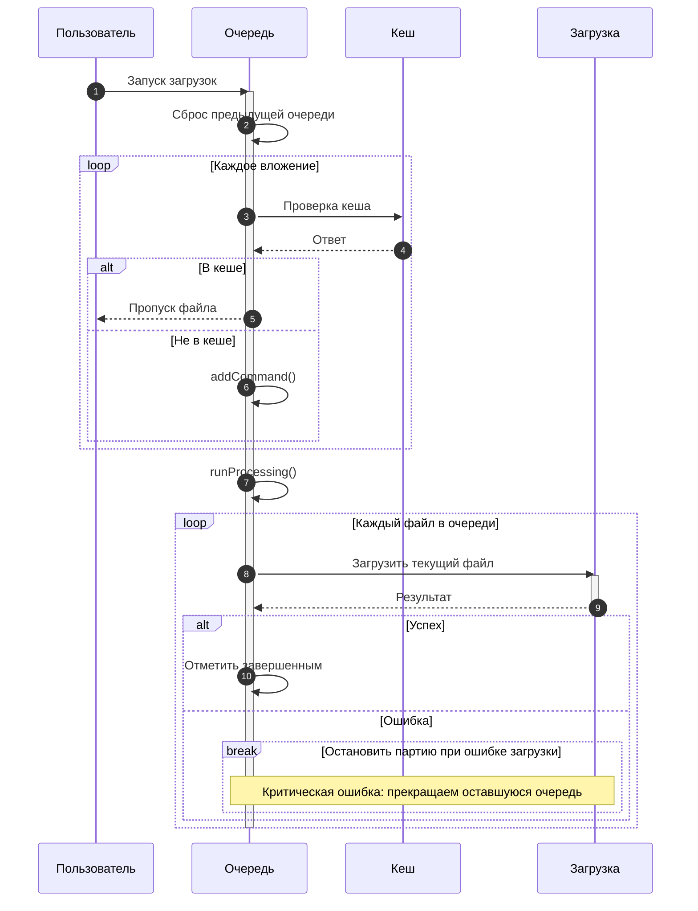

# Сценарий 1: Базовая загрузка файлов через очередь

## Обзор
Данный сценарий описывает базовый процесс загрузки файлов, где файлы скачиваются последовательно через управляемую систему очередей без каких-либо внешних прерываний или пользовательских вмешательств.

## Техническая реализация
- **Хранилище очереди (Valtio)**: `stores/downloadQueue/valtioState.ts`
- **Отслеживание прогресса**: `stores/downloadProgress/downloadProgressStore.ts`
- **Управление файлами**: `lib/files.ts` с использованием Expo File System v17+ и `react-native-blob-util`
- **Контекст загрузки**: `contexts/downloadMessageAttachments.tsx`
- **Хук загрузки**: `hooks/useDownloadMessageAttachments.tsx`

## Пользовательский сценарий

### Шаг 1: Инициализация очереди
1. Пользователь инициирует действие загрузки файлов (например, скачивает вложения сообщений)
2. Система проверяет наличие файлов в кеше с помощью `fileExistsInCache(filename)`
3. Очередь сбрасывается для чистого запуска, затем файлы добавляются через `downloadQueueActions.addCommand()`

### Шаг 2: Последовательная обработка
1. После добавления всех файлов в очередь начинается пакетная обработка
2. Отображается текущее состояние очереди: "Загружается X из Y файлов"
3. Каждый файл показывает индивидуальный прогресс в процентах на основе полученных/общих байтов
4. Файлы загружаются в каталог кеша с использованием аутентифицированных API-вызовов

### Шаг 3: Мониторинг прогресса
1. Обновления прогресса в реальном времени для каждого файла:
   - Полученные байты против общих байтов
   - Процент завершения (0-100%)
   - Имя текущего обрабатываемого файла
2. Отслеживание прогресса на уровне очереди:
   - Номер текущего файла в последовательности
   - Общее количество файлов в очереди
   - Общий статус завершения

### Шаг 4: Завершение
1. Каждый завершенный файл отмечается как обработанный в очереди
2. Файлы сохраняются в каталоге кеша для будущего доступа
3. Прогресс очереди обновляется для отражения завершения
4. Финальный статус: "Все файлы успешно загружены"

## Технический поток

```
Действие пользователя → Проверка очереди → Проверка кеша → Начало загрузки
         ↓                      ↓                ↓              ↓
Добавить в очередь → Обработать следующий → Проверить сеть → Загрузить файл
         ↓                      ↓                ↓              ↓
Обновить UI → Показать прогресс → Обновить прогресс → Отметить завершенным
         ↓                      ↓                ↓              ↓
Продолжить → Обработать следующий → Повторить процесс → Очередь пуста
```



## Ключевые функции

### Дедупликация
- Файлы дедуплицируются по имени файла перед добавлением в очередь
- Существующие файлы в кеше автоматически пропускаются

### Последовательная обработка
- Загрузки происходят по одному файлу за раз, чтобы не перегружать устройство
- Очередь поддерживает порядок и обрабатывает файлы по принципу FIFO

### Постоянство
- Состояние очереди (команды + completed IDs) сохраняется через MMKV с помощью Valtio `subscribe()`
- Частичный прогресс не сохраняется; файл перезапускается при повторной обработке

### Обработка ошибок
- Сетевые ошибки останавливают текущий файл и завершают обработку до повторного запуска
- Ошибки аутентификации останавливают обработку до их устранения
- Ошибка файла завершает обработку текущей партии

## Ожидаемое поведение

### Нормальное завершение
- Очередь обрабатывает все файлы последовательно
- Каждый файл достигает 100% завершения
- Все файлы становятся доступными в кеше
- Очередь становится пустой при завершении

### Поведение при попадании в кеш
- Ранее загруженные файлы пропускаются немедленно
- Очередь содержит только новые/отсутствующие файлы
- Прогресс отражает только фактически необходимые загрузки

### Сетевые условия
- Загрузки приостанавливаются или останавливаются при недоступности сети
- Очередь возобновляется при восстановлении условий и повторном запуске обработки
- Прогресс прерванного файла начинается заново

## Состояния UI

### Состояние загрузки
- Полоса прогресса, показывающая прогресс текущего файла (0-100%)
- Текст: "Загружается [имя файла] ([X] из [Y])"

### Состояние завершения
- Сообщение об успехе: "Все файлы загружены"
- Сводка времени загрузки
- Опция просмотра загруженных файлов

### Состояние ошибки
- Сообщение об ошибке с опцией повтора
- Имя неудачного файла и причина
- Пауза очереди с ручным возобновлением

## Характеристики производительности

### Использование памяти
- Загрузка одного файла за раз минимизирует объем памяти
- Отслеживание прогресса использует минимальное хранилище состояния
- Управление кешем предотвращает дублированное хранение

### Сетевая эффективность
- Аутентифицированные загрузки с инъекцией токена
- Обратные вызовы прогресса для обратной связи в реальном времени
- Управление соединениями через `react-native-blob-util`

### Управление хранилищем
- Файлы хранятся в каталоге кеша приложения
- Автоматическое создание и управление каталогом
- Согласованное именование и организация файлов