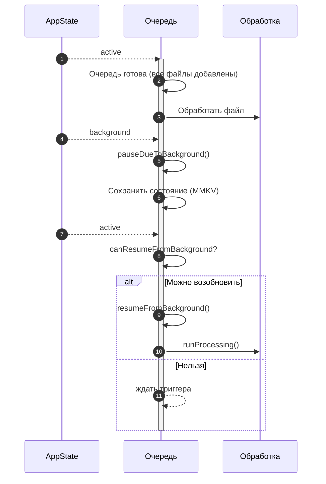

# Сценарий 2: Загрузка файлов при переходе в фоновый/основной режим

## Обзор
Данный сценарий описывает поведение загрузки файлов при переключении приложения между фоновым и основным состоянием во время процесса загрузки. Система интеллектуально приостанавливает и возобновляет загрузки в зависимости от состояния приложения.

## Техническая реализация
- **Мониторинг состояния приложения**: `hooks/useAppState.tsx`
- **Состояние очереди + флаги паузы**: `stores/downloadQueue/valtioState.ts`
- **Цикл обработки + загрузки**: `contexts/downloadMessageAttachments.tsx`
- **Триггер возобновления**: `hooks/useDownloadMessageAttachments.tsx`
- **Определение состояния**: API `AppState` React Native

## Пользовательский сценарий

### Шаг 1: Начальный запуск загрузки
1. Пользователь инициирует очередь загрузки файлов
2. Процесс загрузки начинается нормально с отображением прогресса
3. Файлы начинают загружаться последовательно как в базовом сценарии очереди

### Шаг 2: Приложение переходит в фон
1. Пользователь переключается на другое приложение или блокирует устройство
2. Состояние приложения изменяется на 'background' или 'inactive'
3. Система обнаруживает изменение состояния через хук `useAppState()`
4. Очередь приостанавливается через `pauseDueToBackground()`
5. Текущая загрузка не возобновляется; новые файлы не стартуют

### Шаг 3: Обработка фонового состояния
1. Загрузки остаются приостановленными пока приложение в фоне
2. Состояние очереди сохраняется в постоянном хранилище (MMKV)
3. Частичный прогресс загрузки поддерживается
4. Фоновая обработка не происходит (ограничения iOS/Android)

### Шаг 4: Возврат на передний план
1. Пользователь возвращается к приложению
2. Состояние приложения изменяется на 'active'
3. `useDownloadMessageAttachments` проверяет `canResumeFromBackground`
4. `resumeFromBackground()` снимает флаг фоновой паузы
5. Очередь перезапускается через `runProcessing()`, если элементы остались

### Шаг 5: Восстановление прогресса
1. Состояние очереди восстанавливается из MMKV (постоянство через Valtio `subscribe()`)
2. Завершенные файлы остаются отмеченными как завершенные
3. Если файл был в процессе, загрузка начинается заново
4. Отслеживание прогресса возобновляется с обновленным UI

## Технический поток

```
Обычная загрузка → Обнаружен фон → Приостановить загрузки → Сохранить состояние
       ↓                 ↓               ↓                    ↓
Приложение активно → AppState.inactive → Остановить обработку → Сохранить в MMKV
       ↓                 ↓               ↓                    ↓
Продолжить → Фоновый режим → Простой сети → Очередь сохранена
       ↓                 ↓               ↓                    ↓
Пользователь возвращается → AppState.active → Возобновить обработку → Восстановить состояние
       ↓                 ↓               ↓                    ↓
Приложение активно → Обнаружить изменение → Начать загрузки → Обновить UI
```


```

## Ключевые функции

### Автоматическое определение состояния
- Мониторинг изменений состояния приложения в реальном времени
- Немедленная реакция на переходы фон/передний план
- Не требуется вмешательство пользователя

### Сохранение очереди
- Состояние очереди сохраняется через Valtio + MMKV
- Причина паузы хранится в `pausedDueToBackground`
- Порядок очереди и приоритеты сохраняются

### Беспрепятственное возобновление
- Загрузки возобновляются, когда приложение активно и обработка запущена повторно
- Возврат происходит через `resumeFromBackground()` + `runProcessing()`
- Не требуется ручной перезапуск

### Управление ресурсами
- Загрузки приостанавливаются для экономии батареи и трафика
- Сетевые соединения правильно закрываются во время фона
- Использование памяти оптимизируется во время неактивного состояния

## Ожидаемое поведение

### Переход в фон
1. Активная загрузка немедленно останавливается
2. UI прогресса показывает состояние "Приостановлено"
3. Сетевая активность прекращается
4. Очередь сохраняет текущую позицию

### Восстановление переднего плана
1. Очередь загрузки возобновляет обработку
2. UI прогресса обновляется для показа текущего статуса
3. Сетевая активность перезапускается
4. Загрузки продолжаются с приостановленного состояния

### Постоянство состояния
- Очередь переживает переход приложения в фон
- Завершенные загрузки остаются завершенными
- Неудачные загрузки сохраняют состояние ошибки
- Индикаторы прогресса восстанавливаются точно

## Состояния UI

### Переход в фон
- Полоса прогресса показывает приостановленное состояние
- Текст: "Загрузки приостановлены - приложение в фоне"
- Визуальный индикатор неактивного состояния

### Возобновление переднего плана
- Полоса прогресса возобновляет анимацию
- Текст: "Возобновление загрузок..."
- Восстанавливаются обычные индикаторы прогресса

### Индикаторы состояния
- Четкая визуальная обратная связь для паузы/возобновления
- Осведомленность о состоянии приложения в UI
- Правильное управление состоянием загрузки

## Характеристики производительности

### Эффективность батареи
- Загрузки автоматически приостанавливаются для экономии батареи
- Сетевые соединения правильно закрываются
- Фоновая обработка минимизирована

### Сохранение трафика
- Нет использования трафика в фоне
- Загрузки возобновляются только когда приложение активно
- Эффективное управление соединениями

### Управление памятью
- Состояние очереди эффективно хранится в MMKV
- Отслеживание прогресса использует минимум памяти
- Правильная очистка во время переходов состояний

## Крайние случаи

### Быстрые изменения состояния
- Множественные быстрые переходы фон/передний план обрабатываются последовательно
- Явного дебаунсинга нет
- Стабильность очереди поддерживается во время переходов состояния

### Длительные фоновые периоды
- Состояние очереди сохраняется в течение длительных периодов
- Нет потери данных во время длительного фонового времени
- Правильное восстановление независимо от длительности фона

### Изменения сети во время фона
- Состояние сети переоценивается при возврате приложения в активное состояние
- Восстановление соединения требуется до повторного запуска обработки
- Ошибки завершают текущий файл и требуют повторного запуска

## Детали реализации

### Определение состояния приложения
```typescript
const { isAppActive } = useAppState();

// Проверка обработки загрузки
if (!isAppActive) {
  console.log('Приложение неактивно, загрузки приостановлены');
  return;
}
```

### Постоянство состояния очереди
- Хранилище Valtio с постоянством MMKV через `subscribe()`
- Автоматическое сохранение состояния во время переходов в фон
- Восстановление состояния при возврате на передний план

### Восстановление после ошибок
- Сетевые ошибки грациозно обрабатываются во время изменений состояния
- Состояние аутентификации поддерживается через переходы
- Правильные процедуры очистки и восстановления