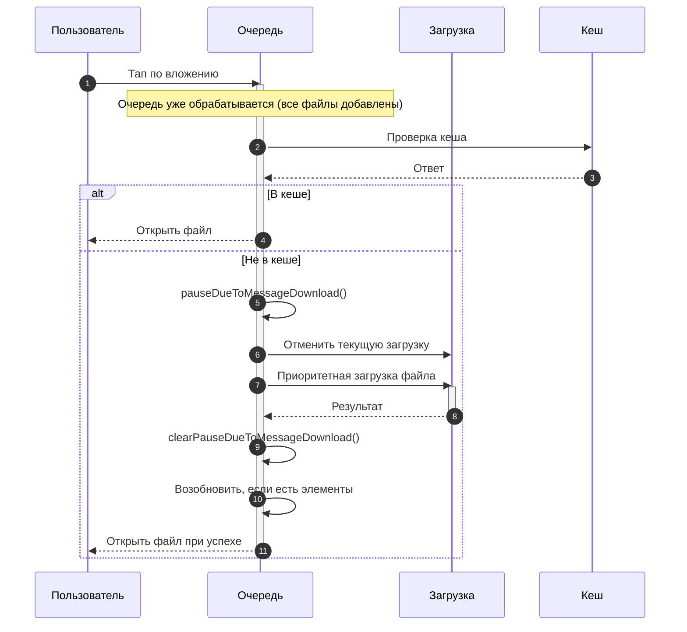

# Сценарий 3: Ускоренная загрузка через вложения сообщений

## Обзор
Данный сценарий описывает механизм приоритетной загрузки, который происходит когда пользователь кликает на вложенный файл внутри сообщения во время активной очереди загрузки. Система временно приостанавливает очередь для обеспечения немедленного доступа к файлу.

## Техническая реализация
- **Приоритетная загрузка**: `contexts/downloadMessageAttachments.tsx`
- **Состояние очереди + флаги паузы**: `stores/downloadQueue/valtioState.ts`
- **Проверка кеша**: `lib/files.ts`
- **UI сообщений**: Обработчики кликов по вложениям сообщений

## Пользовательский сценарий

### Шаг 1: Очередь в процессе
1. Очередь загрузки активно обрабатывает файлы
2. Множественные файлы загружаются последовательно
3. Индикаторы прогресса показывают текущий статус загрузки
4. Пользователь переходит к сообщению с вложениями

### Шаг 2: Клик по вложению
1. Пользователь кликает на вложенный файл в сообщении
2. Система немедленно проверяет кеш для файла
3. Если файл существует в кеше, открывается сразу
4. Если не в кеше, запускается процесс приоритетной загрузки

### Шаг 3: Активация приоритетной загрузки
1. Очередь приостанавливается через `pauseDueToMessageDownload()`
2. Текущая загрузка отменяется (RNFetchBlob cancel)
3. Запускается приоритетная загрузка выбранного файла
4. Статус очереди отражает режим паузы

### Шаг 4: Ускоренная обработка
1. Кликнутый файл загружается с полным сетевым приоритетом
2. Прогресс показывается специально для этого файла
3. Другие файлы в очереди остаются приостановленными
4. Загрузка обходит нормальный порядок очереди

### Шаг 5: Завершение и возобновление очереди
1. Приоритетная загрузка файла завершается
2. Файл открывается автоматически (например, PDF-просмотрщик)
3. Файл удаляется из обычной очереди, если он был в очереди
4. Флаг паузы для сообщения снимается
5. Очередь возобновляется только при наличии авторизации и отсутствии паузы по фону/аутентификации

## Технический поток

```
Очередь активна → Пользователь кликает → Проверка кеша → Приоритетная загрузка
       ↓                ↓                   ↓                    ↓
Обработка → Вложение → Файл отсутствует → Приостановить очередь
       ↓                ↓                   ↓                    ↓
Последовательная → Событие клика → Не в кеше → Начать приоритет
       ↓                ↓                   ↓                    ↓
Продолжить → Обработать клик → Начать загрузку → Показать прогресс
       ↓                ↓                   ↓                    ↓
Обычная → Загрузить файл → Завершить → Возобновить очередь
```


```

## Ключевые функции

### Немедленная проверка кеша
- Мгновенный отклик для файлов в кеше
- Загрузка не нужна для ранее доступных файлов
- Прямое открытие файла для кешированного контента

### Приостановка очереди
- Активная загрузка отменяется, чтобы освободить очередь
- Прогресс отмененной загрузки не сохраняется
- Состояние очереди поддерживается во время приоритетной загрузки

### Приоритетная обработка
- Кликнутый файл получает полную пропускную способность сети
- Загружается вне нормального порядка очереди
- Немедленная обратная связь и отклик пользователя

### Автоматическое возобновление
- Очередь возобновляется после завершения приоритетной загрузки
- Не требуется ручное вмешательство
- Беспрепятственный переход обратно к нормальной обработке

## Ожидаемое поведение

### Попадание в кеш (мгновенный доступ)
1. Пользователь кликает вложение
2. Файл найден в кеше немедленно
3. Файл открывается без задержки
4. Нет прерывания текущей очереди

### Промах кеша (приоритетная загрузка)
1. Пользователь кликает вложение
2. Текущая загрузка отменяется и очередь ставится на паузу
3. Приоритетная загрузка начинается немедленно
4. Файл загружается с индикацией прогресса
5. Файл открывается по завершении
6. Очередь возобновляется, если нет других причин паузы

### Интеграция с очередью
- Файл удаляется из очереди, если он уже был в очереди
- Нет дублированных загрузок
- Порядок очереди сохраняется для оставшихся файлов

## Состояния UI

### Отклик при попадании в кеш
- Немедленное открытие файла
- Индикаторы прогресса не нужны
- Мгновенное удовлетворение пользователя

### Активная приоритетная загрузка
- Спиннер на выбранном вложении
- Статус очереди остается в режиме паузы

### Переход завершения
- Файл открывается автоматически
- Статус очереди: "Возобновление обработки очереди"
- Восстанавливаются обычные индикаторы прогресса

## Характеристики производительности

### Время отклика
- Мгновенный отклик при попадании в кеш (< 100 мс)
- Быстрая инициация приоритетной загрузки
- Сетевые ресурсы выделены приоритетному файлу

### Управление ресурсами
- Одна приоритетная загрузка за раз
- Ресурсы очереди правильно приостанавливаются и возобновляются
- Эффективное использование сети

### Пользовательский опыт
- Нет ожидания завершения очереди
- Немедленный доступ к нужным файлам
- Прозрачное управление очередью

## Детали реализации

### Логика проверки кеша
```typescript
const downloadFileFromMessage = async (attachment: Attachment) => {
  // 1. Сначала проверить кеш
  const existsInCache = fileExistsInCache(filename);
  if (existsInCache) {
    return getCacheFilePath(filename);
  }
  
  // 2. Приоритетная загрузка если не в кеше
       pauseDueToMessageDownload();
       await currentTaskRef.current?.cancel();
       const filePath = await downloadFile({ filename });
       clearPauseDueToMessageDownload();
       resumeProcessing();
  
  return filePath;
};
```

### Координация очереди
- Приостановить активную обработку очереди
- Удалить дублирующие записи
- Управлять сетевыми ресурсами
- Возобновить с сохраненным состоянием

### Механизм приоритета
- Обойти нормальный порядок очереди
- Выделенные ресурсы загрузки
- Обратная связь прогресса в реальном времени
- Автоматическая обработка завершения

## Крайние случаи

### Множественные приоритетные запросы
- Только одна приоритетная загрузка за раз
- Следующий клик запускает приоритетную загрузку после завершения текущей

### Сетевые сбои во время приоритета
- Обработка ошибок специфичная для приоритетных загрузок
- Приоритетные загрузки не повторяются автоматически

### Конфликты состояния очереди
- Удаление дублирующего файла из обычной очереди
- Поддерживается консистентность состояния
- Координация отслеживания прогресса

## Преимущества пользовательского опыта

### Немедленное удовлетворение
- Нет ожидания завершения очереди
- Прямой доступ к нужным файлам
- Отзывчивый пользовательский интерфейс

### Прозрачная работа
- Четкая индикация приоритетной обработки
- Статус очереди всегда видим
- Плавный переход между режимами

### Эффективное использование ресурсов
- Оптимальное использование сети
- Умное использование кеша
- Минимальное вмешательство пользователя